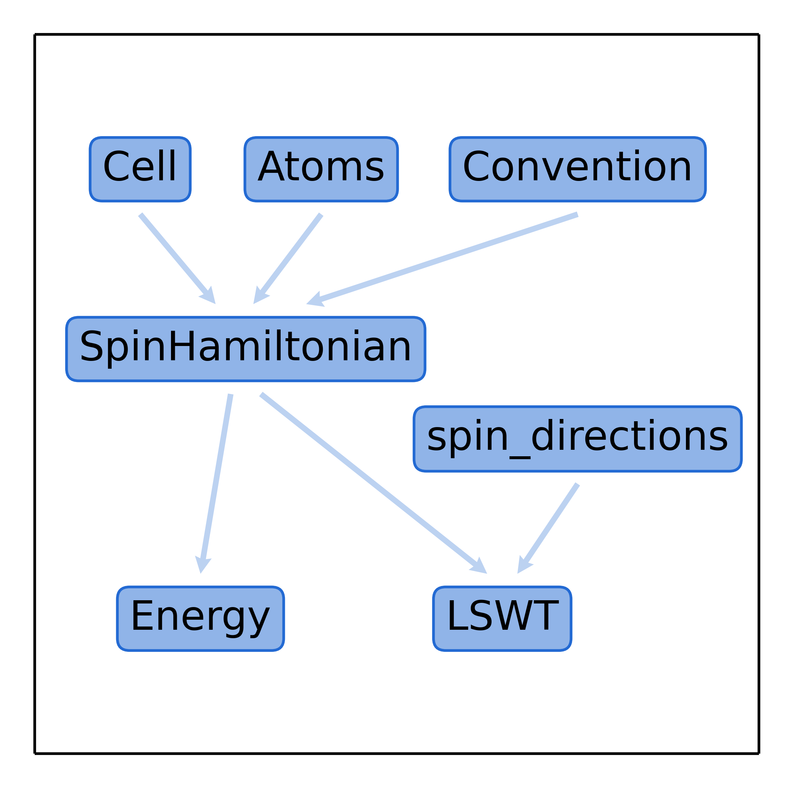

.. _user-guide_usage_data-structures:

**************************
Data structures (overview)
**************************

A number of data structures are defined in magnopy. Two of them are inherited from the
|wulfric|_ package (:ref:`user-guide_usage_cell` and :ref:`user-guide_usage_atoms`). Some
are used to store the parameters of spin Hamiltonian
(:ref:`user-guide_usage_spin-hamiltonian` and  :ref:`user-guide_usage_convention`) or
specify its ground state (:ref:`user-guide_usage_spin-directions`). Other represent
levels of theory and serve as a collection of the things that can be computed
(:ref:`user-guide_usage_lswt`, :ref:`user-guide_usage_energy`).

For the technical reference on how each function, class, method or attribute behaves see
:ref:`api`.

The image below highlights connections between some of magnopy's data structures.

The picture can be read as:

* :py:class:`magnopy.SpinHamiltonian` can be created from :ref:`user-guide_usage_cell`,
  :ref:`user-guide_usage_atoms` and :py:class:`magnopy.Convention`;
* :py:class:`magnopy.Energy` can be created from :py:class:`magnopy.SpinHamiltonian`;
* :py:class:`magnopy.LSWT` can be created from :py:class:`magnopy.SpinHamiltonian` and
  :ref:`user-guide_usage_spin-directions`.
