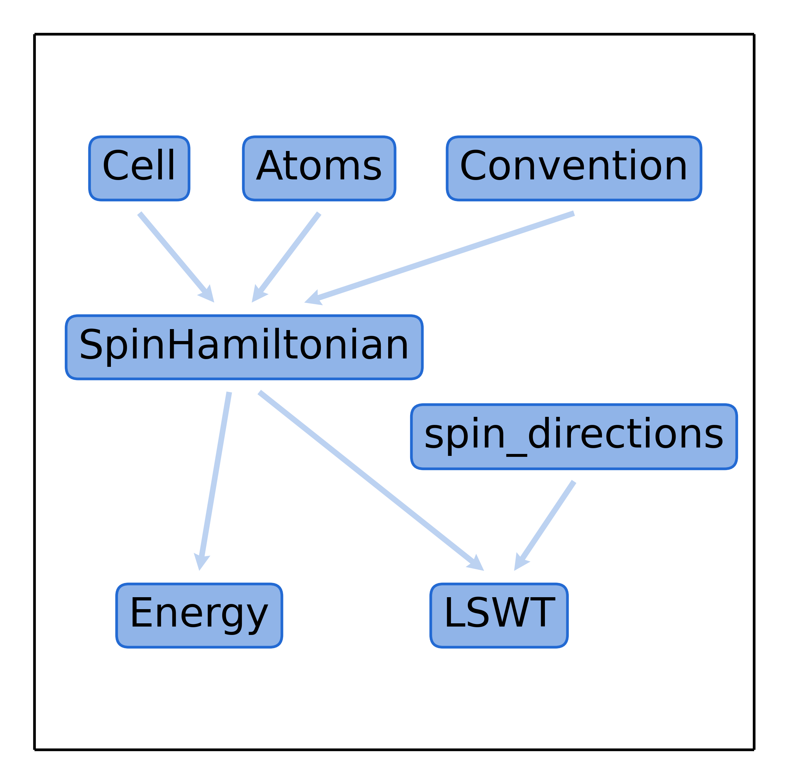

.. _user-guide_usage_overview:

********
Overview
********

Almost every calculation with Magnopy begins with the creation of a
:py:class:`magnopy.SpinHamiltonian` object, that handles a
:ref:`user-guide_theory-behind_spin-hamiltonian`.

This object is created from three other objects

* :ref:`user-guide_usage_cell` - a unit cell of the system;
* :ref:`user-guide_usage_atoms` - a list of atoms in the system;
* :ref:`user-guide_usage_convention` - a convention that defines how the spin Hamiltonian is
  written.

When those three objects are created, then

* :ref:`user-guide_usage_spin-hamiltonian` can be created from them

Once an instance of :py:class:`magnopy.SpinHamiltonian` exists, then
you can add (:py:meth:`magnopy.SpinHamiltonian.add`) or remove
(:py:meth:`magnopy.SpinHamiltonian.remove`) an interaction parameters. As well as do many
other things that are present in :ref:`api` page.

Then, from the spin Hamiltonian with some parameters, you can create an instance of
the :py:class:`magnopy.Energy` class to compute the energy of the system in any
state or optimize the spin directions to find the vacuum state.

Or you can create an instance of the :py:class:`magnopy.LSWT` class to compute the
parts of the bosonic Hamiltonian at the linear spin wave theory level.

The picture can be read as:

* :py:class:`magnopy.SpinHamiltonian` can be created from :ref:`user-guide_usage_cell`,
  :ref:`user-guide_usage_atoms` and :py:class:`magnopy.Convention`;
* :py:class:`magnopy.Energy` can be created from :py:class:`magnopy.SpinHamiltonian`;
* :py:class:`magnopy.LSWT` can be created from :py:class:`magnopy.SpinHamiltonian` and
  :ref:`user-guide_usage_spin-directions`.
